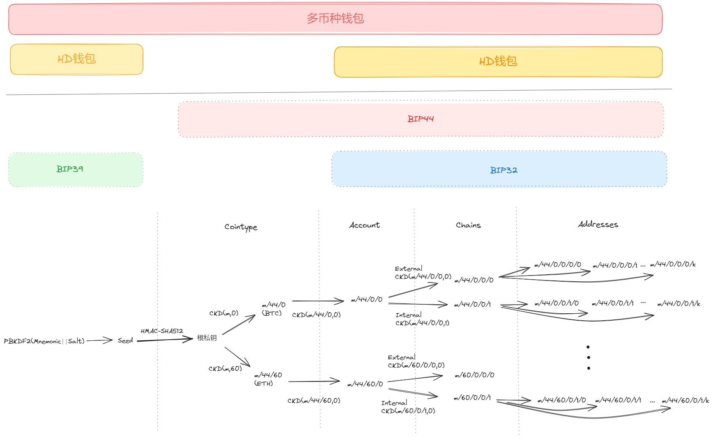

## 什么是HD钱包和多币种钱包

HD（Hierarchical Deterministic，分层确定性）钱包和多币种钱包之间可以有关联，但它们是两个不同的概念。

1. **HD钱包** ：HD钱包是一种钱包结构，它使用分层结构来管理和生成密钥对。通过HD钱包，用户可以从单个种子生成整个钱包的密钥对，并且可以轻松备份和恢复整个钱包。HD钱包使用的分层结构允许用户以分层方式组织密钥，例如根据用途或币种进行分类。
2. **多币种钱包** ：多币种钱包是一种钱包，允许用户存储和管理多种不同类型的加密货币。这种钱包可以支持比特币、以太坊、莱特币等多种加密货币，用户可以在同一个钱包中管理这些不同种类的资产。

关系：

* HD钱包可以是多币种钱包，也可以不是。HD钱包本身只是一种钱包结构，它可以用来管理单一币种的密钥，也可以用来管理多个币种的密钥。
* 如果一个钱包既使用了分层确定性的结构（HD钱包），又支持多种加密货币，那么它就是一个既是HD钱包又是多币种钱包的钱包。

总的来说，HD钱包和多币种钱包是两个不同的概念，但它们可以结合在一起，使得用户可以方便地管理多个加密货币，并且可以通过单个种子备份和恢复整个钱包。

## 什么是密钥对，跟地址有什么关系

密钥对在加密货币中是非常重要的概念，它由两个部分组成：私钥（Private Key）和公钥（Public Key）。这两个部分是密切相关的，它们之间存在着密钥对（Key Pair）的关系。

1. **私钥（Private Key）** ：私钥是一串由随机数字和字母组成的长字符串，它是加密货币钱包的核心之一。私钥只有拥有者知道，并且应该严格保密，因为它能够控制钱包中的资金。任何拥有私钥的人都可以使用它来签署交易，从而发送加密货币。
2. **公钥（Public Key）** ：公钥是从私钥派生出来的，它是私钥的一个衍生物。公钥是一个与私钥对应的字符串，但与私钥不同，它可以被公开分享而不会对资金的安全性产生影响。公钥通常用于加密货币交易中的收款地址的生成。

密钥对与地址的关系如下：

3. **地址（Address）** ：地址是用户用于接收加密货币的字符串。地址是从公钥派生出来的，通过对公钥进行哈希处理和其他加密算法，最终得到一个唯一的、与特定加密货币网络相关联的地址。地址通常由一串字母和数字组成，例如比特币地址以"1"或者"3"开头，以确保其唯一性。

所以，私钥和公钥之间存在着一对一的关系，同时公钥又可以通过加密算法生成地址。当交易被发送至某个地址时，只有拥有相应私钥的人才能对这笔交易进行签名，并最终花费该地址中的资金。

公钥、私钥、地址的逻辑关系： **钱包生成私钥→私钥生成公钥→公钥生成公钥哈希→公钥哈希生成地址→地址用来接受比特币** 。

## 什么是助记词、种子和根私钥

> 助记词、种子和根私钥之间存在密切的关系，它们构成了分层确定性钱包（HD钱包）的核心组成部分。

1. **助记词** ：助记词是一组易于记忆的单词，通常由12、15、18、21或24个单词组成。这些助记词是通过随机数生成的，目的是为了更方便地备份和恢复钱包。助记词被设计成足够复杂和随机，以便安全地生成种子。
2. **种子** ：种子是一个由助记词通过一定的算法生成的随机二进制序列。助记词可以通过一种称为PBKDF2（Password-Based Key Derivation Function 2）的算法转换为种子。PBKDF2算法使用助记词和一个称为“盐（salt）”的附加随机数据来生成种子。种子具有足够的随机性和熵，可以安全地用作生成根私钥的原材料。
3. **根私钥** ：根私钥是通过对种子应用密码学哈希函数（例如HMAC-SHA512）生成的第一个私钥。根私钥是分层确定性钱包（HD钱包）结构中的起点，可以通过对根私钥进行分层派生来生成子私钥和子公钥，从而形成整个钱包的层次结构。这里注意，根私钥不一定要是256位的。可以是128位，或196位或其他位数，只要强度足够大（一般要求至少128位）就行，而由其计算出来的派生私钥则一定是256位的。

因此，助记词是种子的人类可读版本，种子是助记词的二进制表示形式，而根私钥是通过对种子进行哈希函数运算生成的起始私钥。这些组件共同构成了分层确定性钱包的基础，使得用户可以轻松备份、恢复和管理他们的加密货币钱包。

## 什么是BIP32、BIP39和BIP44

> BIP32、BIP39和BIP44是Bitcoin Improvement Proposals（比特币改进提案）中定义的三种标准，用于增强比特币和其他加密货币钱包的功能和安全性。

**BIP32** （确定性钱包）：BIP32定义了确定性钱包的标准，它允许从单个种子 seed 生成一个树状结构储存多组 keypairs（私钥和公钥），进而根据树状结构具体结点上的keypair生成具体的钱包（如BTC钱包、ETH钱包）。这些密钥对可以用于生成接收和发送加密货币的地址，而无需存储每个地址的单独私钥。BIP32通过使用分层确定性钱包（HD钱包）的概念来管理这些密钥对，使得用户可以通过单个种子备份和恢复整个钱包。

* **分层**：是指一个seed可以生成一个有层级关系的树状结构储存多组keypairs，子节点是由父节点根据一定的算法派生出来的。

> 原文文献：https://github.com/bitcoin/bips/blob/master/bip-0032.mediawiki

**引用原文献图*

**BIP39** （助记词）：BIP39定义了一种用于生成和管理助记词的标准。助记词是一组易于记忆的单词，通常包含12、15、18、21或24个单词。这些助记词用于从种子生成主私钥，进而生成钱包中的所有其他密钥对。BIP39旨在提高用户备份和恢复钱包的便捷性和安全性，因为助记词比长串的随机字符更易于记忆和手写备份。

* **助记词的生成过程**：先生成一个 128 位随机数，再加上对随机数做的校验 4 位，得到 132 位的一个数，然后按每 11 位做切分，这样就有了 12 个二进制数，然后用每个数去查 BIP39 定义的单词表，这样就得到 12 个助记词。助记词词库共包含 2048 个单词;
* **种子的生成过程**：助记词通过一系列的密码学哈希函数和其他算法转换为二进制形式的种子。这个过程包括对助记词进行 PBKDF2 哈希和加盐（salt）处理，以生成足够强大和安全的种子，以用作生成根私钥的起点。

**BIP44** （多币种钱包）：BIP44建立在BIP32的基础上，定义了用于多币种钱包的层次确定性钱包的标准。它引入了更多的层次结构，以便支持多个币种，并且为每个币种都定义了一个唯一的币种代码。这使得单个助记词可以生成多个加密货币的钱包，并且可以通过类似的层次结构进行管理，让同一个 seed 可以支持多币种、多帐户等，以提高钱包的可用性和安全性。

各层定义和其中各字母代表的含义如下：

m / purpose' / coin_type' / account' / change' / address_index' /

m： 代表公链

purpose： 一般为「44」，代表遵循 BIP44 方案，但 BTC 隔离见证地址为「49」

coin_type： 代表币种类型，其中 0 为 BTC，1 为 BTC 测试网，2 为 LTC，60 为 ETH 等

account ： 代表此币种的账户索引，从 0 开始

change： 数值 0 用于外部链，1 用于内部链。一个用于创建接收地址，另一个用来创造找零地址

address_index ： 地址索引，从 0 开始

例如：

m/44'/0'/0'/0/0代表一个BTC钱包path

m/44'/60'/0'/0/0代表一个ETH钱包path

因此，这三个标准之间的联系在于它们都致力于改善加密货币钱包的功能、安全性和便捷性。BIP32提供了分层确定性钱包的基础，BIP39通过助记词提供了更便捷的备份和恢复方式，而BIP44则进一步扩展了分层确定性钱包以支持多币种钱包。

以上知识点汇总如下图：

