## 📖阅读本文，你将

1. 快速理解三个主流的共识机制。
2. 它们是：`PoW`、`PoS`、`DPos`

## 0、为何要理解 **共识机制**？

上一篇文章 [《前端视角web3入门：啥是区块链，凭啥能安全分布存储？》](https://juejin.cn/post/7184957720192090167)里，我主要从以下几个方面介绍了什么是区块链：

- 区块链的定义
- 区块链的数据结构
- 区块链的通知、分布式存储
- 以 `PoW` 为例介绍了共识机制

其中，关于 **共识机制** 这块，只是浅尝辄止，介绍了 `PoW` 为什么能做到让人无法篡改。

那么 **共识机制** 重要么？

我感觉是 **非常重要** 的，不能理解共识机制，就不能理解一个链是否安全、是否真的去中心化、不能理解它是真的区块链还是骗局。

打个不恰当的比方：

> 区块链的数据结构只是一个个并无什么区别的足球。

> 但不同的共识机制，却会衍生出截然不同的结局。就像你一脚踢出去，那叫踢皮球，而梅西一脚踢出去，可能就叫世界波。

因此，有的链是比特币，有些币从一出生，就注定是显而易见的庞氏骗局。

目前市面上，得到普遍认可的共识机制，主要有以下几类：

- PoW
- PoS
- DPos

让我们一个个来进行理解，它们是怎么做到 **防篡改** 的。

## 一、**PoW**: 依靠算力竞赛的开拓者

`PoW（Proof of Work）`的意思是：工作量证明。是世界上最著名的 **共识机制**，因为它来源于区块链的第一个成熟应用：比特币。

它的原理，用一句话进行描述就是：

> 全世界所有的参与者都可以使用计算机算力，来和篡改者赛跑。篡改者必须要拥有超过全世界 51% 的算力，才可能完成篡改。

也许你还不理解，没关系，让我们从头讲起，这里需要一些前缀知识，假设你已经大致知道了 **区块链的数据结构、及去中心化存储** 的基本概念。

> 不清楚？没关系，看我的这篇文章先了解下：[《前端视角web3入门：啥是区块链，凭啥能安全分布存储？》](https://juejin.cn/post/7184957720192090167)

那么，现在，如何用 **工作量证明** 完成数据防篡改操作呢？

> 我，春哥，一个程序员，画了一组漫画。

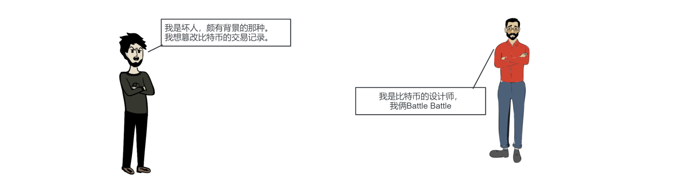
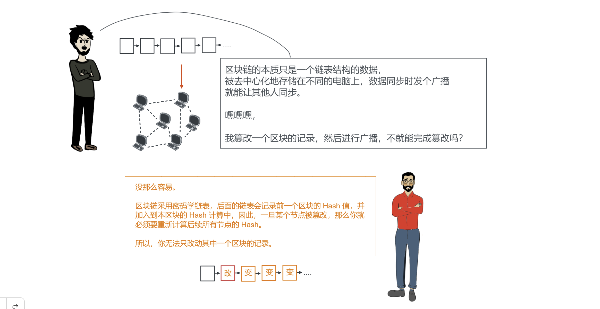
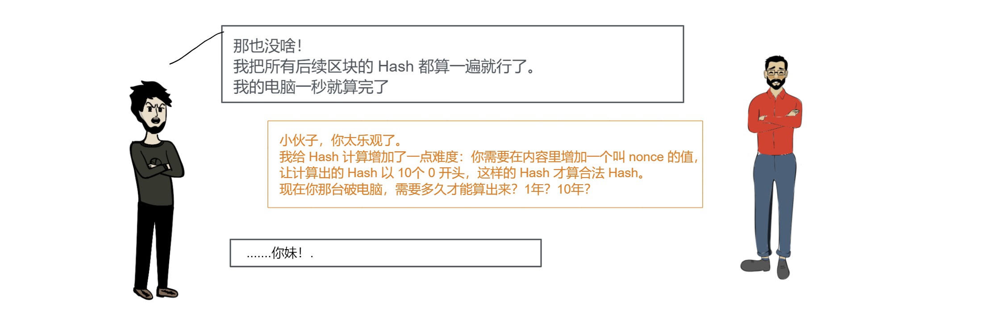
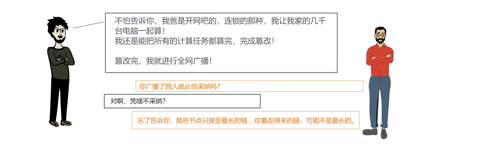
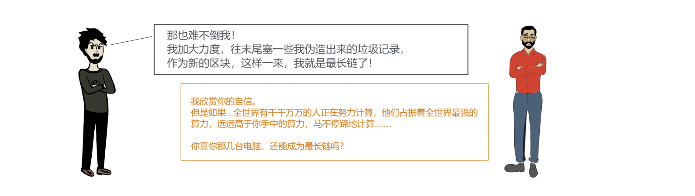
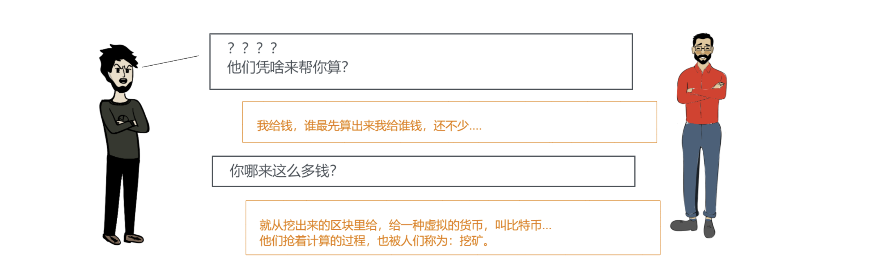

`PoW` 的原理基本如此，但一些细节也就没在漫画里赘述，本文还是以理解核心原理为主。

`PoW` 依靠这个机制完成了对自身交易能力的保证，那么它有没有什么缺点呢？

当然！

它最大的问题就在于，它需要耗费大量的计算，而计算又伴随着巨额的能量消耗。每年都有巨大的能量消耗在毫无意义地 `Hash` 计算中。

因此，作为一款成熟的货币，比特币产生新区块时，**能耗过大** 的问题，是必须面对，且必须解决的。

一种新的 **共识机制** 更迫切地被人们所需要，它至少得解决 **能源问题** 这一关键痛点。

于是，**PoS** 诞生了。

## 二、**PoS**: 资产持有者的游戏

`PoS（Proof of Stake）`的意思是：股权证明。它是一种被设计出来替代 `PoW` 的共识机制。

它的原理，用一句话进行描述就是：

> 参与者必须抵押一笔不菲的资金才能参与选拔，被随机选中者产出新区块，再由N个被随机选中的评委确定新区块是否合法。非法区块就罚款产出者。

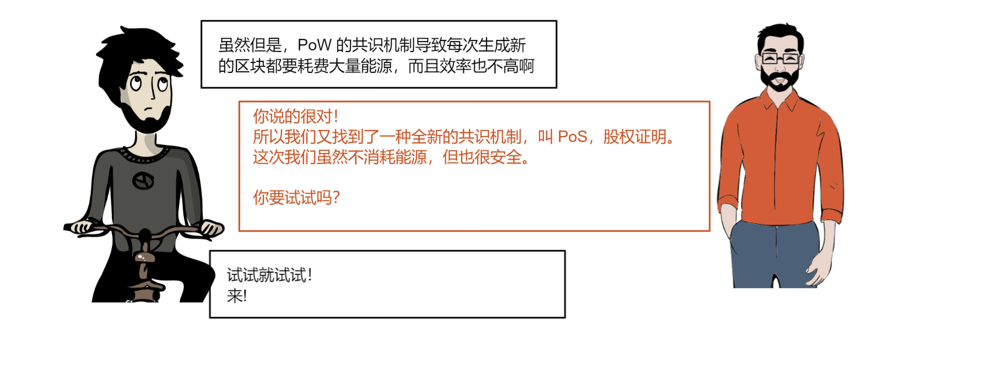
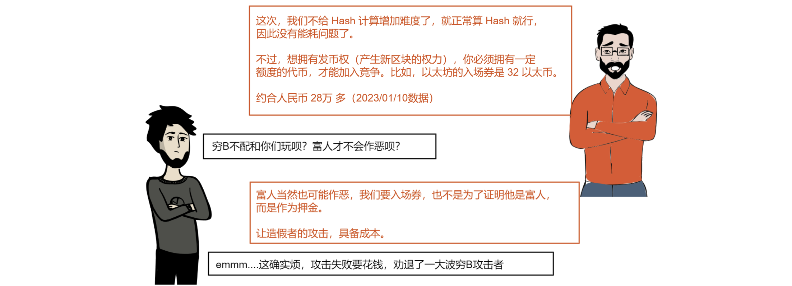
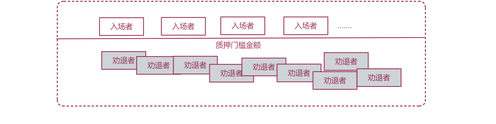
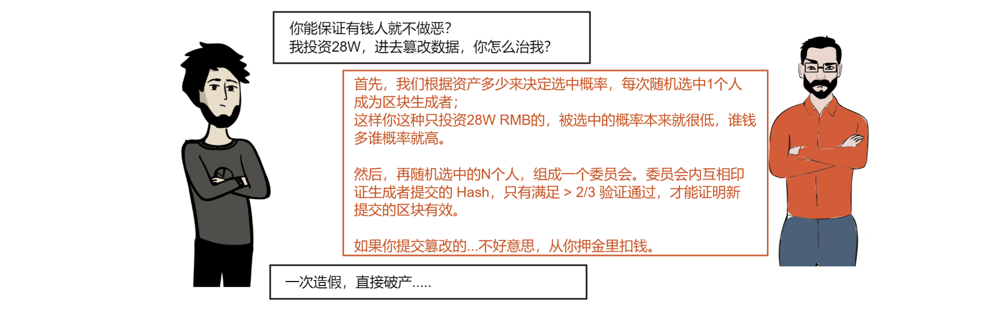
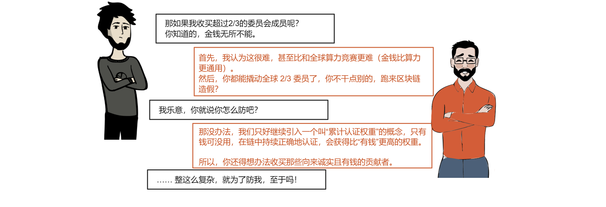

> 问得好！

`PoS` 的优势非常明显，它不消耗算力，而且想要通过策反节点完成篡改的难度比 `PoW` 更大，但它也存在一个显著缺点：

> 富贵者愈富，贫穷者连局都入不了。

这和 **去中心化** 的概念是背道而驰的，也是 `PoS` 最被诟病的一点。

## 三、**DPoS**: 请挑选英雄

`DPoS（Delegated Proof of Shake）`的意思是：委托股权证明。它是一种被设计出来解决 `PoS` 过于中心化问题的共识机制。

它的原理，用一句话进行描述就是：

> 所有节点通过投票，选拔出若干位 “候选人”，在候选人中随机选中一位 “新区块生产者”。这位生产者产生新区块带来的收益，所有投票他的人也会获得奖励。

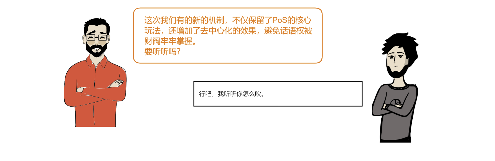
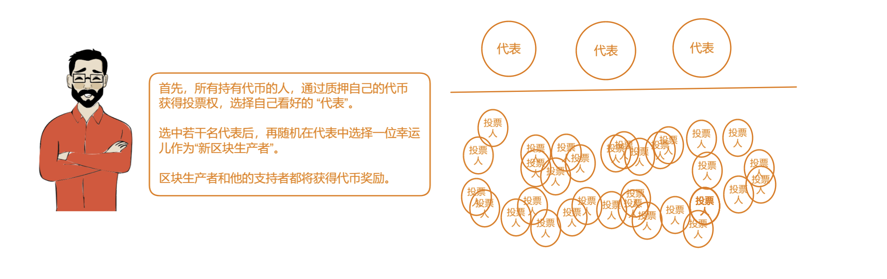
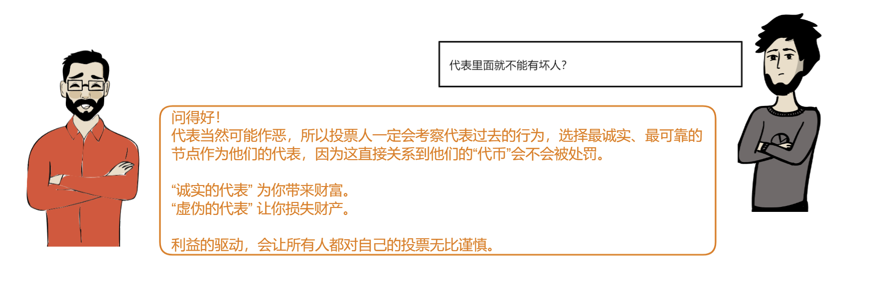
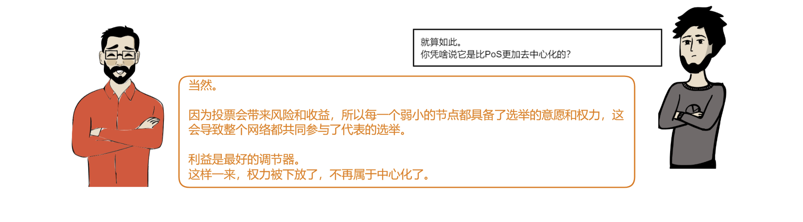
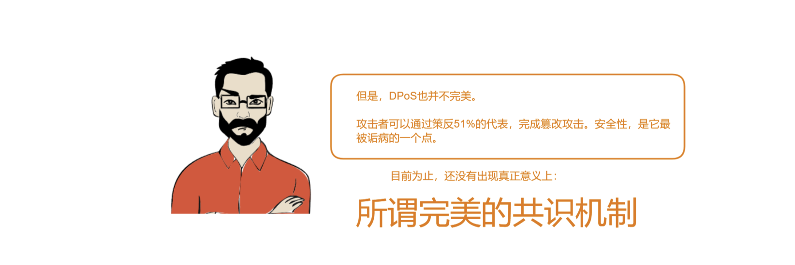

## 小结

以上，我们就通过三组漫画，简单了解了目前市面上最主流的三种共识机制。

> `PoW`、`PoS`、`DPos`。

但它们是终点吗？
  - 显然不。

它们完善吗？
  - 显然不。

市面上还有更多的共识机制、还会有更多更多的新机制在未来产生。

理解它们，才能理解区块链安全的本质。

这就是我学习 `Web3` 的第二课，如果你觉得对你有帮助，不妨关注我的专栏：

[> 前端学Web3，从入门到出门 <](https://juejin.cn/column/7184955788048203831)