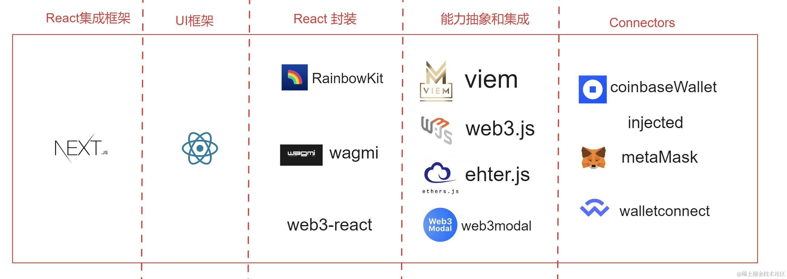
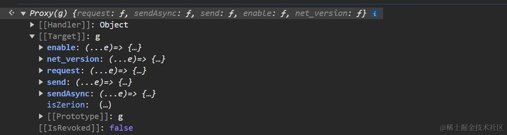
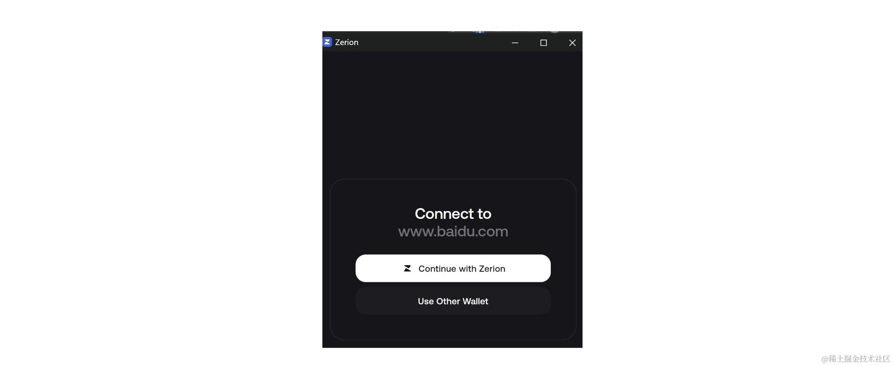
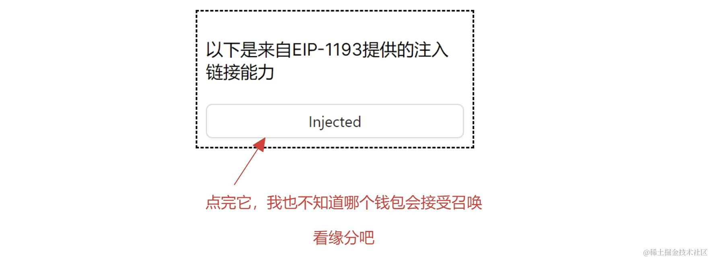
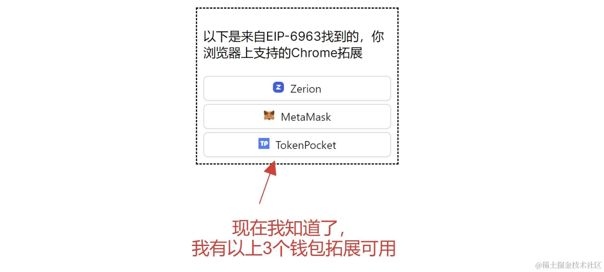
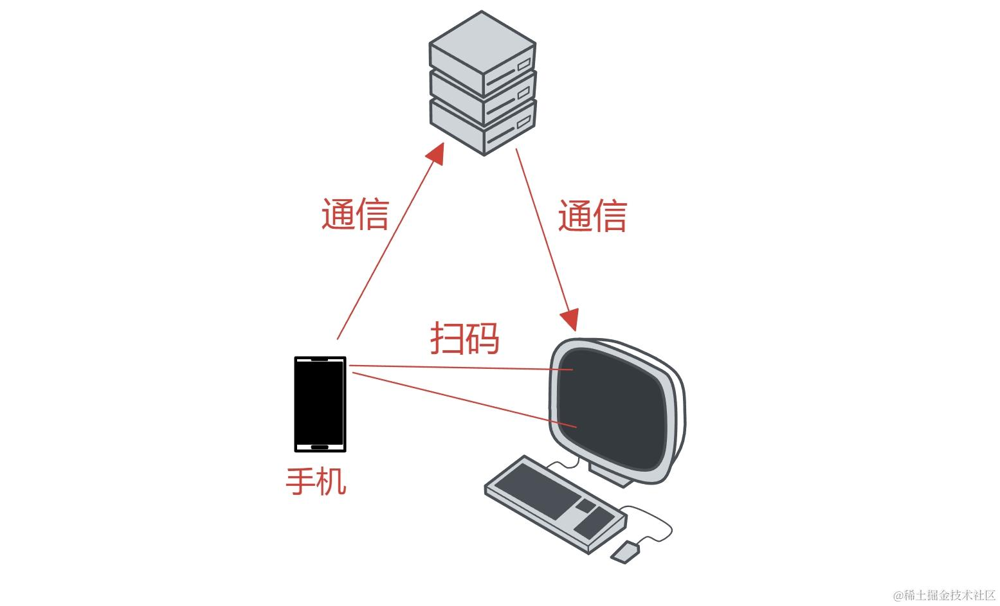
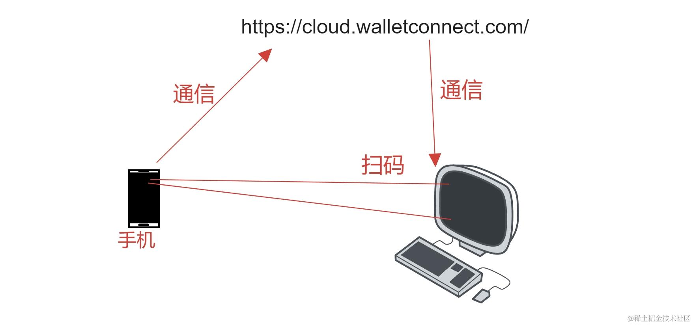
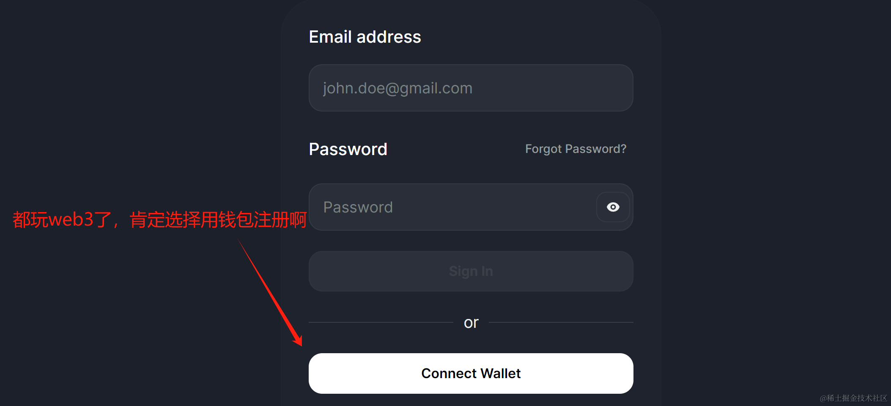
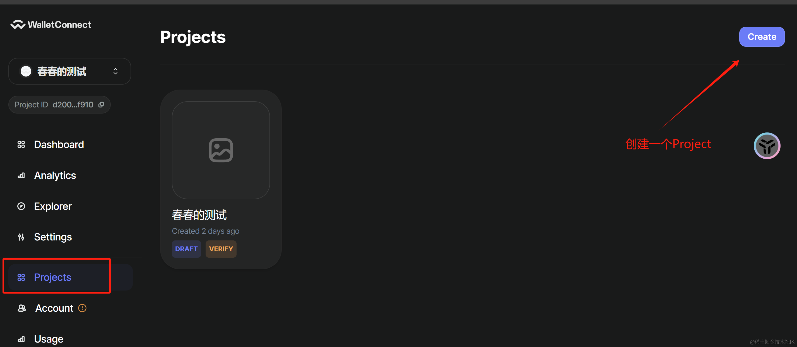
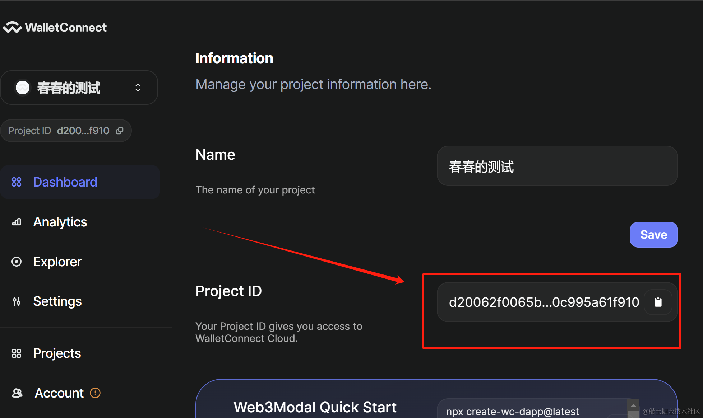

## 📖阅读本文，你将

1.  获取一个 `demo` 仓库。
2.  从思路上理清 【链接钱包】 这件事的思路。
3.  认识 `EIP-1193` 协议。
4.  认识 `EIP-6963` 协议。
5.  认识 `WalletConnect` 相关平台和能力。
6.  学会 `wagmi` 的基本使用。

## 01、web3世界里，钱包（Wallet）是最重要的

> 在web3的领域，钱包就是身份证 + 账号密码 + 验证码等一切。

`web3`的钱包记录着你的以下几个关键内容：

*   你的私钥 `private-key`.
*   你的钱包地址 `wallet-address`.

你可通过使用钱包，对任何请求进行签名和响应授权、交易等行为，以此证明“你就是你”。

可以说，`web3`的钱包不仅仅是你的身份证，更是你的通行证和令牌。

因此，在 `web3` 中链接钱包，就像 `web2` 中“使用账号密码登录”一样常见，作为“实战开发”的第一课，恰如其份。

首先，你需要准备一个 `web3` 钱包，这属于入门基础，你可以先去任何别的文章先了解一二，至少能拥有一个 `web3` 钱包，可以是浏览器插件，也可以是手机上的钱包APP。

为了和主流技术不脱节，本文将采用 `web3` 圈最主流的技术进行实现。

*   前端框架：`react` + `next.js`
*   前端请求状态库：`react-query`
*   `React Hooks`库 ：`wagmi`
*   手机钱包链接平台：[cloud.walletconnect.com](https://cloud.walletconnect.com/)

## 02、基本架构和生态位

当我们学东西时，最初的疑问可能并不是“这个工具怎么用”，而是：**这是个什么库？我为什么要用它？它在工具链里处于什么位置？有哪些平替？**



我大概按自己的理解，给目前 `web3` 主流库划分了一个分层。（当然，保不齐可能有错的，欢迎指正，我也是初学者）。

*   `connector`：钱包链接库，主要提供钱包链接相关能力。
*   能力抽象和封装：对常见 `web3` 能力进行了封装抽象，让大家能更轻易地进行常规`web3` 操作。
*   `React` 封装：对常见能力，进行针对 `React` 的更一步封装，状态化、Hook化。
*   `UI` 库：这一层在 `web3` 领域被推荐的几乎只有 `React`。
*   `React` 集成框架： 这一层几乎只有 `next.js`。

可能有人会问，为什么 `UI` 层没有 `vue`，我只能说按我目前的观察，在 `web3` 领域，`React` + `Next.js` 几乎是唯一的选择。当然你可以说 “`React`能做到的，`Vue`都能做到。”，话虽如此，但生态就是这样，没有什么好争论的。

## 03、先理清思路，如何链接浏览器拓展？

> 假设一下，如果你现在是一个架构师，你需要负责设计一个网站，外加一个 `Chrome` 浏览器拓展。当你在页面上点击一个按钮之后，拓展就会被唤醒，然后当用户进行一系列操作之后，拓展会返回一些信息给页面。

你会怎么设计？

常规思路，无外乎：

1.  找到常规的 `HTML` 页面和 `Chrome` 浏览器拓展通信的方式，约定好通信协议，啥时候算唤起，啥时候算关闭，啥时候返回什么内容算结束。
2.  编写拓展，按照协议进行通信。

问题来了，如果此时，有很多其他网站的开发者，也希望接入你的拓展。那么他们就得按你设计的协议来进行通信。

然后，有另外的开发商开发了和你同样能力的拓展，也希望无成本地给所有网站接入。他们也得遵从你的协议来。

对，这里的 `HTML` 就是所有需要链接钱包的 `DAPP`，这里的 `Chrome` 浏览器拓展就是所有安装在浏览器上的 `web3` 钱包。

为了应对茫茫多的钱包和页面复用的问题，大家都需要一个标准。

于是，有了 `EIP-1193` 标准。

## 3.1 什么是 `EIP-1193`？

> 如果你想让你的浏览器拓展和页面进行通信，那么你需要遵循 `EIP-1193` 协议。

`EIP-1193` 协议，是 `Ethereum` 社区提出的浏览器拓展和页面通信协议，它是 `web3` 生态中最基础的协议。

## 3.2 `EIP-1193` 提供了哪些标准？

> `EIP` 是 `（Ethereum Improvement Proposal）` 的简称。1193 是 `EIP-1193` 的编号。

`EIP-1193` 最大的特点是，它希望钱包可以将其 `provider` 对象暴露给页面，然后页面就可以通过这个 `provider` 对象进行交互。

而暴露给`provider`的方式，就是将其注入到 `window.ethereum` 对象中。

因此，只要你的电脑装了任何一个号称支持 `EIP-1193` 的 `web3` 钱包，那么你就能在任何一个页面的控制台里，发现这个 `window.ethereum` 对象。



看到了上面的对象了吗？其中属于 `EIP-1193` 协议标准的只有 `request` 函数。其他都是各种钱包携带的私货。

那么 `EIP-1193` 标准协议，究竟应该如何连接钱包呢？

尝试在任何网页，打开控制台，输入以下代码：

```javascript
await window.ethereum.request({
  method: 'eth_requestAccounts',
})
```

只要你的浏览器里有任何支持 `EIP-1193` 的 `web3` 钱包，你就能看到以下结果：



ok, 这就是 `EIP-1193` 标准协议的连接方式。

但是等等，你有没有发现 `EIP-1193` 缺失了一些重要的内容？

比如：

*   我不能知道控制我要调用的 `provider` 具体指向哪个钱包，这完全依赖于浏览器拓展的加载顺序。
*   我更无法清晰了解到我有哪几个钱包可用，以及它们的基本信息。



为了应对这个问题，`EIP-6963` 协议应运而生。

## 3.3 `EIP-6963` 解决了什么问题？

> `EIP-6963` 正是为了解决 `EIP-1193` 协议的缺陷而提出的。

它定义了一组 `window event`，让钱包可以和页面进行双向通信。

比如，当钱包监听到页面的 `eip6963:requestProvider` 事件后，就可以将自己的 `provider` 和元信息返回给页面。

这样一来，页面就可以知道有哪些钱包可用，以及它们的基本信息。



理解到这里就够了，目前使用浏览器拓展的 `web3` 钱包，基本都是基于 `EIP-6963` 标准或者 `EIP-1193` 标准。

## 04、如何链接手机钱包？

> `Web` 端登录，却希望手机客户端来验证授权，最常见的方式是什么？

扫码登录。

思考一下，你会怎么设计？

ok，现在你需要一个额外的服务用来生成二维码，并且提供可供用户手机访问的链接，完成认证后再通知你的 `web` 浏览器，从而完成交互。



`WalletConnect` 云服务，就是这样的一个中心化网站，它提供便捷的 `web3` 钱包链接 `Saas` 服务。

有了它，你可以省下一台自己的服务器，并且省去写那些繁琐的代码。



访问：<https://cloud.walletconnect.com/> 注册一个账号。

不用担心，注册非常简单。你甚至可以用你刚刚生成的钱包地址就能完成注册。



然后去创建一个 `Project`。


其他信息随便写写就行，关键是要获取这个 `ProjectId`。它会在你的 `DApp` 中用到。



记住你的 `ProjectId`。

## 05、基于 `Next.js` 搭建项目

使用以下命令，就可以快速创建一个 `Next.js` 项目：

```shell
npx create-next-app@latest
```

然后 `cd` 到你的项目目录，执行以下命令：

```shell
# npm yarn 都一样
pnpm install @tanstack/react-query@latest antd@5.x viem@2.x wagmi@2.x
```

至于 `demo` 具体的代码，我放在了这个仓库里：

<https://github.com/zhangshichun/wagmi-demos>

并且通过 `vercel` 部署了一个可以直接线上访问的 `demo`：

<https://wagmi-demos.vercel.app/01-wallet-connect>

(当然，可能需要一些科学和魔法)

下面，我会对本节涉及到的 `demo` 难点进行逐一讲解。

## 05、`Next.js` 中提供 `Provider`

众所周知，`Next.js` 默认的页面配置是 `SSR` 的。初学者如果不熟悉的话，在给 `wagmi` 配置 `Provider` 时，可能会遇到一些问题。

例如：
我们按照 `wagmi` 的教程，一开始就需要配置如下一套 `React Provider` 供后续的 `Hooks` 消费:

```jsx
<WagmiProvider config={config}>
  <QueryClientProvider client={queryClient}>
    {children}
  </QueryClientProvider>
</WagmiProvider>
```

但是最新版本 `Next.js` 的 `app/layout.jsx` 文件默认是 `use Server` 的，而 `Provider` 等能力因为是运行在 `client` 端，所以需要 `use Client`。

在 `app/layout.jsx` 中，我们往往要编写一些不适合 `client` 端运行的代码，比如配置 `meta` 等。

这就产生了一个矛盾：如何在 `app/layout.jsx` 中，同时使用 `Server` 和 `Client` 呢？

`Next.js` 官方给出了解决方案：你可以另外创建一个 `app/wallet-provider.jsx` 文件，专门用来提供 `Provider`。在这个文件中你可以大胆地使用 `use client`。

并在 `app/layout.jsx` 中，`import` 进来，然后使用即可。

```jsx
import WalletProvider from "./wallet-provider";

export default function RootLayout({
  children,
}: Readonly<{
  children: React.ReactNode;
}>) {
  return (
    <html lang="en">
      <body className={inter.className}>
        <WalletProvider>{children}</WalletProvider>
      </body>
    </html>
  );
}
```

以上代码建议参考这三个文件：

[@/configs/wallet.ts](https://github.com/zhangshichun/wagmi-demos/blob/master/src/configs/wallet.ts)

[@/app/layout.tsx](https://github.com/zhangshichun/wagmi-demos/blob/master/src/app/layout.tsx)

[@/app/wallet-provider.tsx](https://github.com/zhangshichun/wagmi-demos/blob/master/src/app/wallet-provider.tsx)

## 06、如何从 `connectors` 中区分不同的方式?

`wagmi` 提供了 `useConnect` 这个 `Hook`，可以用来获取当前可用的 `connectors`。

但你仍然需要从中分辨出这些 `connector` 本来的面目：

主要有三类：

*   第一类，`connector.id === "walletConnect"` 的，这一类是 `@walletconnect/ethereum-provider` 库提供的，通过它，你可以便捷地使用手机扫码登录钱包。
*   第二类，`connector.id === "injected"` 的，这一类是 `EIP-1193` 协议提供的，在你的多个插件争夺 `window.ethereum` 对象中，获得胜利的那个钱包提供的能力。
*   第三类，其他的，这一类是 `EIP-6963` 协议提供的，你可以获取到具体的拓展名称和 `icon`，链接到具体的钱包。

## 关于我

我是春哥，一个前端工程师。\
目前正在学习 `web3` 领域。\
如果你有任何问题，欢迎留言。
