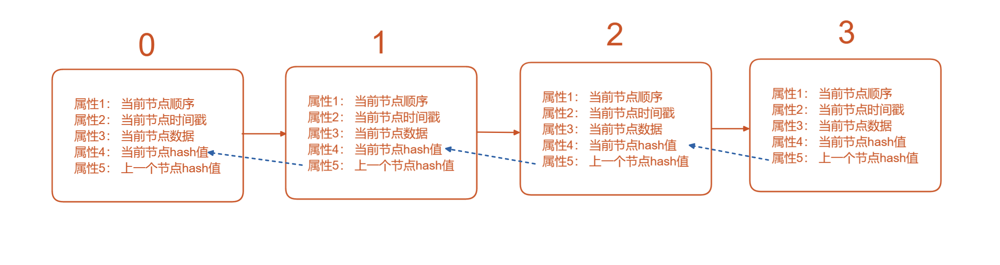
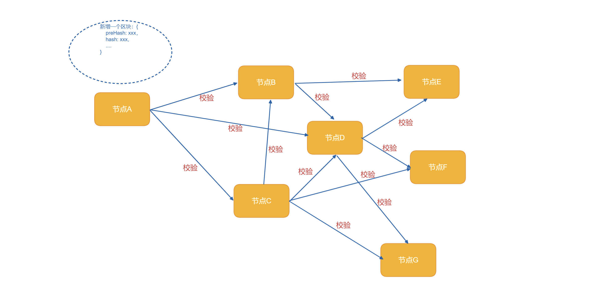
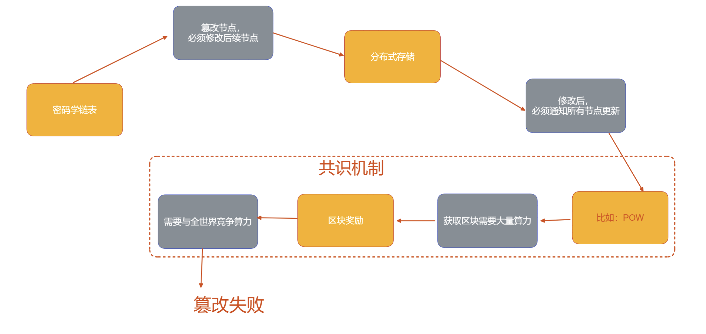

## 一、为什么我要开始学 **“区块链”**？

首先声明，我不炒币，不是韭菜。  

其次声明，我也不嘎韭菜。  

但我认为 `WEB3`、“元宇宙” 等去中心化概念的兴起并不是无风之浪，在我们轻率地把它们定义为 “骗韭菜” 之前，不妨先了解一下，它们的原理是什么？是否可以拥有更多的想象力，在很多信息化项目、智慧化项目里发挥作用？

万一，我是说万一，`Web3` 万一真的是未来呢？

心态要 `Open`，况且，目前很多远程 `Web3` 岗位的薪酬也是很诱人的呢……哈哈，扯远了。

在我的2022年终总结里：[《2022总结：33岁，不瞎卷了，停下等一等灵魂》](https://juejin.cn/post/7182006463786090552)，我给自己立下了 “学习 `Web3`” 的 `Flag`。

用输出倒逼输入，边学边写。

总之，面对未知，我选择先了解，然后再选择是否批判。

## 二、什么是 **“区块链”**？

> 区块链（`BlockChain`）是一种**去中心化**、**分布式数据存储技术**，并且具备极强的 **防篡改** 特性。

关键词：

- 去中心化
- 分布式
- 数据存储技术
- 防篡改

只是用概念上理解: **“区块链”** 这项技术可以让多台计算机之间共享数据、无需中心服务，并且通过密码学手段让每个终端获取到数据后，想要进行篡改变得非常困难，因此可以保证每个终端同步到的数据是真实可信的。

听起来很神奇，对不对？

别害怕，没有魔法，全是科技和狠活儿，一学就会，一讲就懂。

## 三、数据结构、安全机制

 **“区块链”** 是怎么做到在分布式存储的同时，还能做到 **防篡改** 的呢？

 这得说到区块链的 **三个安全特性**:

- 特性一：密码学链表结构。
- 特性二：去中心化存储 and 广播机制。
- 特性三：共识机制 (本文会主要介绍 `POW` 机制)

这三大特性，从根本上保证了区块链可以在多个终端上去中心化地存储，并且做到 **防篡改**。

让我们一一理解，它是怎么做到防篡改的：

### 3.1 密码学链表结构

**区块链** 之所以叫 **区块链**，而不是叫 分布存储、去中心数据库 等这些名字，是取决于它的 **数据结构**。

区块链，采用的正是经典的 **链表结构**：



我们先提出一个极简模式的 **区块链** 模型，在这个链表结构上，每一个节点被称为 **一个区块**（`Block`），它至少具备以下属性：

- 当前节点的顺序：在链中的下标，如：0、1、2、3...
- 当前节点的时间戳：当前节点的创建时间，如：`1672795356300`
- 当前节点的数据：一般用于记录业务信息，可以是一个 `JSON` 对象。
- 上一个节点的 `Hash` 值：持有前任的 `Hash`，能够保证整个链条的稳定性。
- 当前节点的 `Hash` 值：用以防止当前节点的关键信息被篡改，通过 `Hash(顺序 + 时间戳 + 数据 + 前任hash)` 的方式，计算出当前节点的 `Hash` 签名。

代码化一下，一个 **极简区块** 的数据结构长这样：

```JSON
  {
    "index": 10,
    "timestamp": 1672797082511,
    "data": {
      "name": "Lily",
      "message": "Nice to meet u :)"
    },
    "preHash": "a665a45920422f9d417e4867efdc4fb8a04a1f3fff1fa07e998e86f7f7a27ae3"
  }
```

> 因为本文主要面向前端，因此示例均采用 `JavaScript` 进行撰写。

通过以上信息，我们就可以写一段非常简单的代码，计算出该区块本身的 `Hash` 值：


```js

// 使用浏览器内置函数计算 Hash （SHA-256）
async function digestMessage(message) {
  const msgUint8 = new TextEncoder().encode(message);
  const hashBuffer = await crypto.subtle.digest('SHA-256', msgUint8);
  const hashArray = Array.from(new Uint8Array(hashBuffer));
  const hashHex = hashArray.map((b) => b.toString(16).padStart(2, '0')).join('');
  return hashHex;
}

// 序列化区块基本信息为字符串
const getBlockString = (block) => { return `${block.index}-${block.timestamp}-${block.preHash}-${JSON.stringify(block.data)}` }

const block0 = {
  "index": 10,
  "timestamp": 1672797082511,
  "data": {
    "name": "Lily",
    "message": "Nice to meet u :)"
  },
  "preHash": "a665a45920422f9d417e4867efdc4fb8a04a1f3fff1fa07e998e86f7f7a27ae3" // 来自前任的hash
}

await digestMessage(getBlockString(block0))

// 输出：2a7074e30087fde57a26972c0fb81d2ac099b64c265d976b9f3b3423b70b2652

```

因此，该区块的完整信息，就可以加上自身的 `Hash` 了：

```JSON
  {
    "index": 10,
    "timestamp": 1672797082511,
    "data": {
      "name": "Lily",
      "message": "Nice to meet u :)"
    },
    "preHash": "a665a45920422f9d417e4867efdc4fb8a04a1f3fff1fa07e998e86f7f7a27ae3",
    "hash": "2a7074e30087fde57a26972c0fb81d2ac099b64c265d976b9f3b3423b70b2652" // 补全了自身的 Hash
  }
```

相比于 **普通链表**，区块链的链表结构里增加了 `Hash` 机制，每个节点在生成自身 `Hash` 时，都必须带上前任的 `Hash` 值，这样就能保证一个基本效果：

> 你无法在不篡改后续区块的情况下，去单独篡改中间的某一个区块。

按照上面的算法，假设存在一款 “通过区块链记录聊天记录的APP”，它的链上存在以下三个区块：

```JSON
[
  // ... 省略前面的记录
  {
    "index": 11,
    "timestamp": 1672802121156,
    "data": {
      "name": "LiLei",
      "message": "Hi,where is Lucy?"
    },
    "preHash": "2a7074e30087fde57a26972c0fb81d2ac099b64c265d976b9f3b3423b70b2652",
    "hash": "b1615ad605d2dd5f6298b1ed7ca2871e37ee737e8efe9b5bc16a0bad04d1d518"
  },
  {
    "index": 12,
    "timestamp": 1672802337779,
    "data": {
      "name": "Lily",
      "message": "She is at David's Home."
    },
    "preHash": "b1615ad605d2dd5f6298b1ed7ca2871e37ee737e8efe9b5bc16a0bad04d1d518",
    "hash": "b43c8f93d3825788b00057621f1e474d857a75b75e4eb98f7f3519f8a41cd3c3"
  },
  {
    "index": 13,
    "timestamp": 1672802921531,
    "data": {
      "name": "LiLei",
      "message": "???!Holy shit!"
    },
    "preHash": "b43c8f93d3825788b00057621f1e474d857a75b75e4eb98f7f3519f8a41cd3c3",
    "hash": "a725251152f6a53791911af78c5bbfb28586bd3d6904fedc31604bf25e8c587e"
  }
  // ... 省略后面的记录
]
```

其实这三个区块记录的内容很简单，是一段简单的对话：

> LiLei: "Hi,where is Lucy?"

> Lily: "She is at David's Home."

> LiLei: "???!Holy shit!"

现在，假设你是 `Lily`，你出于妒忌，诬陷了自己的姐姐 `Lucy` 正在大卫的家里，事后你很后悔，你想篡改聊天记录，把 `"She is at David's Home."` 删掉一个单词，变成：`"She is at Home."`。

然后你发现：
> 除非你把后续所有记录的 `Hash` 进行一次篡改，否则的话，你根本无法只修改其中的一条记录。

因为：每一个节点的变化，都会导致后续节点引用的 `preHash` 发生变化，从而像多米诺骨牌一样，导致整个大厦坍塌。

现在你明白了，区块链 **密码学链表** 的数据结构，能保证：

> 你无法在不修改后续所有区块的情况下，单独篡改其中的某一条区块。

那么问题来了，如果 `Lily` 特别狠，她不仅篡改了其中一条，又把后续所有的区块的 `Hash` 都从新算了一遍，又怎么办呢？

那得提到区块链的 **去中心化存储 & 广播机制**。

### 3.2 去中心化存储 `and` 广播机制

如果区块链的数据只被存储在一台计算机上，那它的 **防篡改机制** 将毫无意义，正如上一节提到的，这唯一持有数据的一台计算机将可以通过篡改后续所有的记录的 `hash`，从而达到篡改某一条记录的事实。

所以，这款 “通过区块链记录聊天记录的APP” ，为了保证自己的区块记录不被随便篡改，每当有新的区块产生时，它都会进行一次广播，以便通知其他计算机新增区块。



通常情况下，当产生新节点后，无需你向所有节点进行广播，而是通过 `P2P` 的方式，就近向已经建立连接的若干个节点进行广播即可。

而后续节点会延续这种行为，从而完成所有节点的通知。

细心的人会发现，上图中广播链条中有 **校验** 二字。

是的，并非所有的广播播都会被认可，它至少应该满足以下几点：

- 当前节点未接收过被广播的新增区块。
- 广播中新增的区块，Hash校验合法。

这样一来，合法的新增区块将被节点群认可，所有的计算机都将进行同步存储。(实际上只要超过一半节点接收，那么该新增区块即算生效)

回到上一节我们提到的问题：

> Lily 如果想把某个区块，和其后续区块都篡改掉，那她则需要在篡改完成后，通知其他节点完成更新。这样，她篡改的内容才会获得共识。

假设：一个中立的节点，从 `LiLei` 那边传来的聊天记录 和 从 `Lily` 那边传来的聊天，存在非常多的区块 `Hash` 不一致的情况，那中立节点应该选择采纳谁的版本呢？

> 目前最通用的方法，是采用 **链最长的那个版本**。

这就存在问题了。

万一 `Lily` 篡改某个节点后，不仅重新生成了后续节点的 `Hash`，还伪造了许多并不存在的聊天记录，这样一来，她所广播的区块链将会是环境中最长的那一个，这样她不就成功完成数据篡改了吗？

所以，就产生了一种机制，能让伪造区块的成本，变得更大，大到 `Lily` 无法轻易生成足够多的节点来篡改后续记录。

这种机制，就叫 **共识机制**。

### 3.3 共识机制

什么是 **共识机制**？

**共识机制** 是用以约束新增的区块，只有当它们及它们的 `Hash` 复合某一特征时，才能被其他节点所接收。

以比特币为例：

> “比特币” 采用的是一种名为 “工作证明（`PoW`）” 的共识机制，在这种共识机制中，你必须通过在区块中增加一个名为 "nonce" 的随机盐值，把它加入到 `Hash` 计算中，值到你计算出的 `Hash` 值以 10 个 `0` 作为开头，你的这个区块的 `Hash` 才被视为有效。

代码举例，假如你有如下区块：

```JSON
  {
    "index": 12,
    "timestamp": 1672802337779,
    "data": {
      "name": "Lily",
      "message": "She is at David's Home."
    },
    "preHash": "b1615ad605d2dd5f6298b1ed7ca2871e37ee737e8efe9b5bc16a0bad04d1d518"
  }
```

按我们再第一节中写的 `JavaScript` 代码为例，你可以很快生成它的 `Hash` 是 "`b43c8f93d3825788b00057621f1e474d857a75b75e4eb98f7f3519f8a41cd3c3`"。

这实在太容易了，因此 `Lily` 可以很轻松地进行篡改和生成。

如果我们提出一个新的规则呢？

新增一个随机数 `nonce` 属性，区块结构变成了这样：

```JSON
  {
    "index": 12,
    "timestamp": 1672802337779,
    "data": {
      "name": "Lily",
      "message": "She is at David's Home."
    },
    "preHash": "b1615ad605d2dd5f6298b1ed7ca2871e37ee737e8efe9b5bc16a0bad04d1d518",
    "nonce": 0 // 看这行，它的值是可变的
  }
```
序列化区块为字符串的函数也变成了这样：

```js
// 序列化区块基本信息为字符串
const getBlockString = (block) => { return `${block.index}-${block.timestamp}-${block.preHash}-${JSON.stringify(block.data)}-${block.nonce}` }
// 主要注意新增的 -${block.nonce}
```

现在，我们出具一个规则：允许你随机生成 `nonce` 属性的数值，只要最终产生的 `Hash` 是以两个`0` 作为开头的，那么我就认为你有效。

让我们试试：
```js
// nonce = 0 时， Hash 为：
'899761b75219e45c1382b5de7f84abd2b107124217ab087ba1b42259d368d031'

// nonce = 1 时，Hash 为：
'3c6dbec4d76883b393f25e2d09c37982c2d1def7ca250bf4ead21b7296d76a90'

// nonce = 2 时，Hash 为：
'2f7750258bb28d437ba840feac72cd4a8f898d95a4559efbe9a306dcdd2b38e5'

// nonce = 3 时，Hash 为：
'cc56cbdc11038635aab1424cf637e6d23e8456474adbc19440b6f26cc02d4aa4'

```

好家伙，手动计算了四次，我已经烦了，于是，我准备写一个循环代码，来找到能够符合“产出`Hash`以两个`0` 作为开头”的 `nonce` 值。

```js
for(let i = 0; i < 1000; i++) {
    const v = await digestMessage(getBlockString({
    "index": 12,
    "timestamp": 1672802337779,
    "data": {
      "name": "Lily",
      "message": "She is at David's Home."
    },
    "preHash": "b1615ad605d2dd5f6298b1ed7ca2871e37ee737e8efe9b5bc16a0bad04d1d518",
    "nonce": i
  }))
  if (v.indexOf('00') == 0) {
      console.log('i', i)
      console.log('hash', v)
      break;
  }
}
```

这样，我们就写出了一个 **最简单的挖矿程序**，瞬间完成了计算：

> 当 `nonce=141` 时，输出的`Hash` 是 `005385f8a00527350affff839cc7618126a23130ba624abaf7b78d25103b83cd`。符合条件。

当然，我们只要求了以两个 `0` 开头，因此计算难度并不大，很容易就能找到符合要求的 `nonce` 值。

但是，如果要求是以 `9个0`、甚至 `10个0` 开头呢？

那么找到一个可用的 `nonce` 将会消耗掉天文数字级别的算力，破 `JavaScript` 单线程什么D东西，也配算？`CPU`什么D东西，也配这种计算密集型场景？

于是有了 `GPU` 和专业的挖矿软件。

说远了，继续说安全性。

上面说到的这种 “特殊要求”，就是目前比特币采用的 `POW` 共识机制。

> 目前市面上除了 `POW` 共识机制外，还有各种各样的共识机制，比如 “以太坊” 采用的 `POS` 等。后面会简单介绍。

假设，现在 `Lily` 使用的这款软件，采用了 `“POW”` 机制，要求新区块的 `Hash` 必须以 `6个0` 作为开头，那么每个区块的生成，都必须经历漫长的计算。

`Lily` 如果想把某个节点的内容篡改，并把后续所有节点的 `Hash` 值都重新生成一遍，那等待她的可能就是大量的耗电、以及长时间的计算。

这可能很难，但如果 `Lily` 拥有一台算力不俗的超级计算机，并且她拥有一大笔资金呢？她依然具备完全修改后续所有区块 `Hash`，并且制造大量虚假区块，让自己持有的链长度最长的能力。

为了解决这种担忧，于是有了压死 `Lily` 的最后一根稻草：

> 区块奖励。

### 3.4 `POW`的区块奖励

虽然计算 `“POW”` 共识机制消耗很大，但如果能力和收益足够大时，一定还是会有人尝试去进行篡改。

因此，“共识机制” 通常还会伴随着一种让篡改者 “能力不足”
的机制。

在比特币的 `POW` 机制中，这种机制叫 **“区块奖励”**。

简单来说，它鼓励大家去计算出新的可用区块，谁率先找到符合条件的 `nonce` 和 `Hash`，谁就能获得一定份额比特币的收益。

因此，全世界的 ~~(海盗)~~ 矿工们趋之若鹜，开始了 “大挖矿时代”。

可怕到难以想象的算力被投入到 “新区块” 的计算中，

这就直接导致了，无论篡改者抱着怎样的目的，只要他手中的算力无法超过全球所有算力的 `50%`，那么他伪造新区块的速度，就一定无法成为 **最长链**。

因此，在以上四种机制的共同作用下，`Lily` 试图篡改一条聊天记录的尝试变得渺茫，她看了看自己的能力，只能确认：

**这种方法确实足够安全**。

让我们捋一下，它是如何一步步组织恶意用户企图篡改某个区块内容的：



> 当然，作为一款聊天软件，存储数据居然要耗费这么多电量是否合理还需要商榷，但本文的主题还是想要介绍 **为啥区块链这么安全** 的原理。

### 3.5 其他主流 **共识机制**

虽然 `POW` 因为比特币而名噪天下，但它也有非常多的内容被人所诟病。

比如：

- 它耗费巨大能源
- 区块的产生受限于算力，基本是每10分钟产生一个新区块，这会直接影响交易的确认。
- 专业大矿场和去中心化初衷相悖而行

因此，在很多时候，`POW` 并不是最优选择，还有很多主流的 **共识机制** 可以进行学习。

比如：

**POS**：`Proof of Stake` 股权证明，根据每个节点持有的代币数量来决定其被选中的概率，选中者获得记账权。

**DPOS**：`Delegated Proof of Stake` 委托股权证明，根据投票选出代理人，从获票最多的代理人中选中N人，然后在这N人中随机选中一人获得记账权。

等等...

每一类 **共识机制** 都有自己的优点和缺点，都多多少少存在安全上的隐患，但它们确实可以在某些场景下顺畅运行，满足区块链 **安全地分布式存储** 的诉求。

在学习区块链相关知识时，**共识机制** 是难点，也是充满魅力的所在，其中关于人性、关于博弈论的应用，让人惊叹。

## 四、小结

到此为止，我和大家一起完成了了解 `Web3` 世界的第一步：

> 认识区块链。

虽然没办法去进行相关开发，但也已经粗略知道了区块链的一些基本概念。

- 什么是区块链？
- 什么是区块？
- 为什么它采用密码学链表结构？
- 为什么它需要分布式存储？
- 为什么它需要共识机制？
- `POW` 如何运作？
- 比特币挖矿的本质是什么？

这些知识，对于后续我们学习撰写智能合约、学习理解交易都有所帮助。

这就是我学习 `Web3` 的第一课，如果你觉得对你有帮助，不妨关注我的专栏：

[> 前端学Web3，从入门到出门 <](https://juejin.cn/column/7184955788048203831)